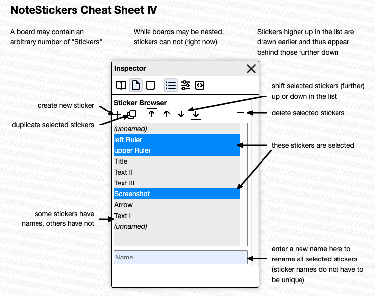
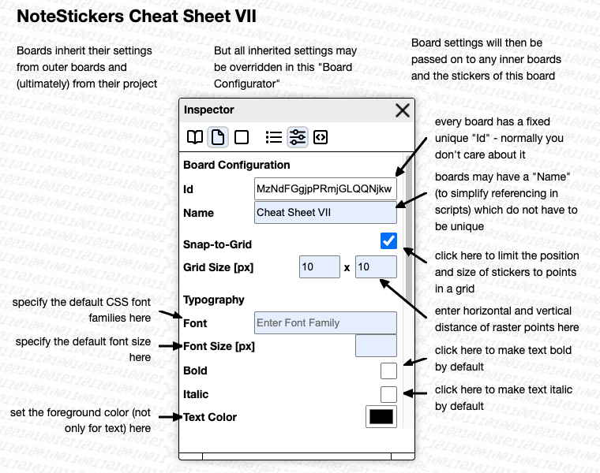

# note-stickers #

(an unshared application based on "[shareable-note-stickers](https://github.com/rozek/shareable-note-stickers)")

"NoteStickers" is the first step in a series of implementation and user studies towards a modern variant of Apple's famous but hopelessly underrated [HyperCard](https://en.m.wikipedia.org/wiki/HyperCard)

> (this is a "work in progress" - do not use it unless you are adventurous - and, if so, "save often" by "export"ing the "whole project" for a later re-import)

[live demo](https://rozek.github.io/note-stickers/dist/) (right now, for internal testing only - there still seems to be a really strange but fundamental problem when running from GitHub.io compared to an instance running from a local server...)

(more to come: Board Configurator, Sticker Configurator, Script Editor, Value Editor)

## License ##

[MIT License](LICENSE.md)
