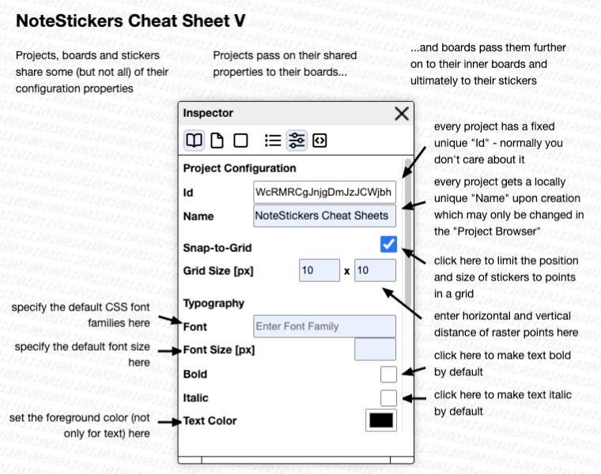
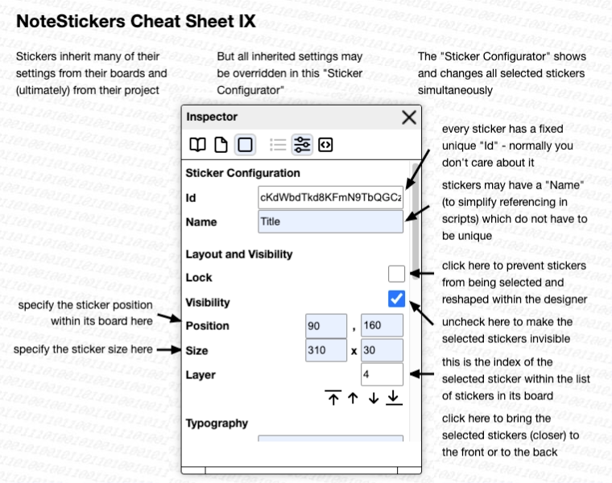
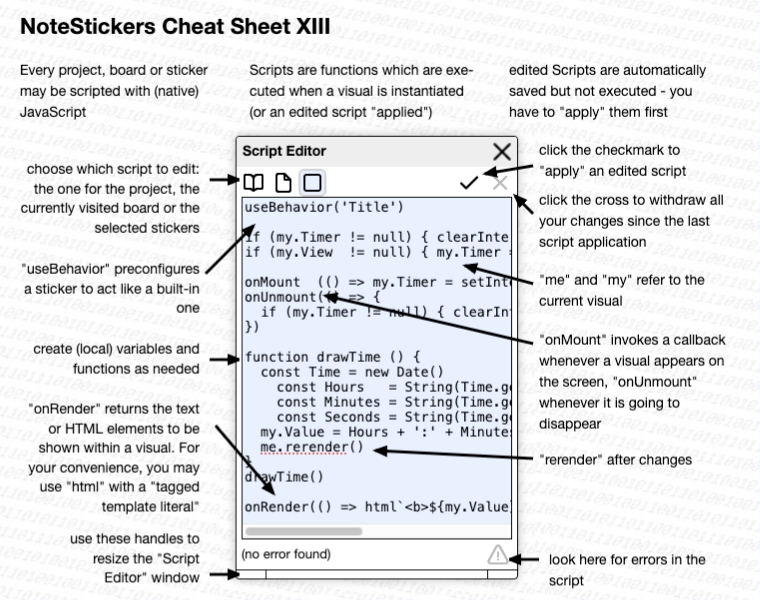

# note-stickers #

(an unshared application based on "[shareable-note-stickers](https://github.com/rozek/shareable-note-stickers)")


"NoteStickers" is the first step in a series of implementation and user studies towards a modern variant of Apple's famous but hopelessly underrated [HyperCard](https://en.m.wikipedia.org/wiki/HyperCard)

> (this is a "work in progress" - do not use it unless you are adventurous - and, if so, "save often" by "export"ing the "whole project" for a later re-import)

[live demo](https://rozek.github.io/note-stickers/dist/) (right now, for internal testing only - there still seems to be a really strange but fundamental problem when running from GitHub.io compared to an instance running from a local server...)

## Overview ##

### Projects ###

"NoteStickers" works with "projects" containing one or multiple (nestable) "boards" with multiple "stickers" (which can not yet be nested). Projects, boards and stickers are special incarnations of "visuals" and share some of their properties.

Projects are automatically saved in a browser's storage area (indexeddb) and may be managed (i.e., created, edited, renamed, deleted) there. Since projects will get lost when the browser's storage is cleared, it is recommended to "download" every project onto the file system from which it may then be "uploaded" again later.

> Nota bene: in the current stage of development it is recommended to "download" often in order to save any work done with "NoteStickers"

### Boards ###

"Boards" always cover the whole HTML element into which "NoteStickers" is rendered - this also includes the application's dialog windows. As a consequence, it is recommended to keep the containing element large enough (normally, the containing element is the document body and "NoteStickers" then covers the whole browser window)

Only one board may be actually shown at a given time - that board is called to be "active" or "visited".

### Stickers ###

Boards may contain "stickers", rectangular areas that may be freely sized and positioned within that board. The visual appearance of every sticker is controlled by its visual "configuration" and its "rendering function". There are many built-in "types" of stickers with specific rendering functions, but you are free to define your own or modify any existing ones. The  configuration of visuals is currently a bit limited: you may only specify the typography, fore- and background color and the background texture (but more properties will be added later).

All stickers of a board have a "rendering order", given by their index in the list of stickers belonging to a given board: stickers with lower indices are rendered earlier than stickers with higher ones. As a consequence, stickers with higher indices may cover (and, thus, perhaps hide) stickers with lower indices.

### Value ###

Every visual may have a "value" which must be a (JSON-)serializable JavaScript value (i.e., a boolean, number, string, array or object).

The value of a sticker usually controls what the sticker renders onto the screen: the value of an "HTML View" contains the HTML to be shown, the value of an "Image View" the URL of the displayed image, that of an "SVG View" the shown SVG content, etc.

Boards and the project itself may also have values, but these often contain (persistable) objects with values used by several other (inner boards and) stickers and have no immediate influence on the appearance of the board or project.

### Scripting ###

All visuals may be scripted. A "script" is (the body of) a JavaScript function which runs in the context of its visual. Scripts are executed whenever the containing visuals are created or when a script is re-"applied" to its visual after being changed at runtime.

Within a script, you have access to the containing visual, the board it belongs to (if such a board exists) and the project itself. You may create local variables and functions, change the visual's configuration and define callbacks that will be executed whenever a visual appeared on the screen, is going to disappear or has to be rendered.

The rendering callback is usually the most important one: here you can compute the contents of a visual and then return either a text to be rendered, a single HTML element or a list of HTML elements that should be shown inside the containing sticker.

> Note bene: you may use the built-in ```html``` function with a template literal to define the desired HTML elements. That function uses [htm](https://github.com/developit/htm) under the hood and therefore allows you to use the "Hyperscript Tagged Markup" defined there

#### Reactivity ####

(t.b.w.) (reactively callback, visual.observed/unobserved, based on [hyperactiv](https://github.com/rozek/hyperactiv))

#### Behaviors ####

(t.b.w.) (built-in behaviors)

### The Life of a Visual ###

(t.b.w.) (continue to exist even while their board is not active)

(to be continued)











## License ##

[MIT License](LICENSE.md)
