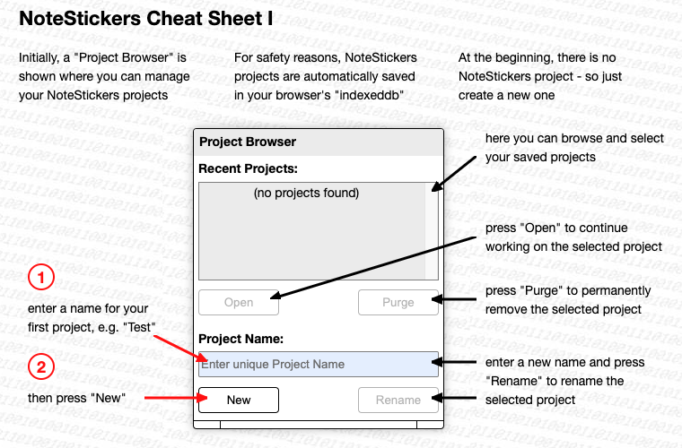
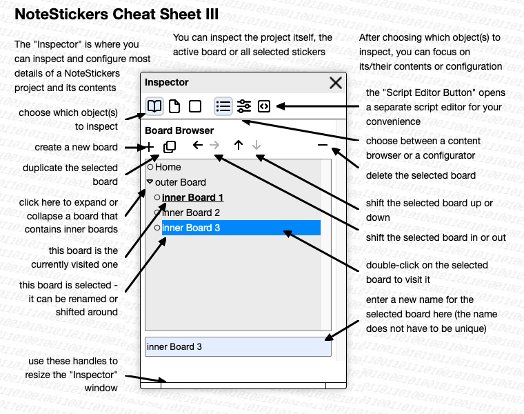
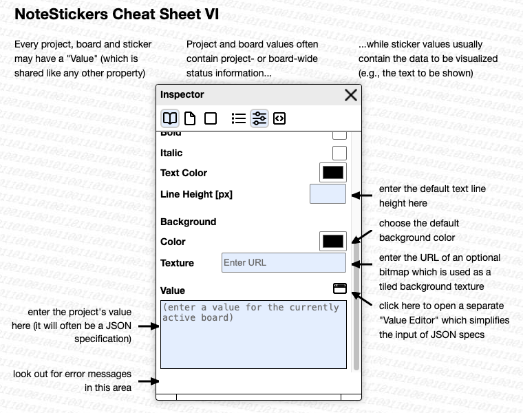
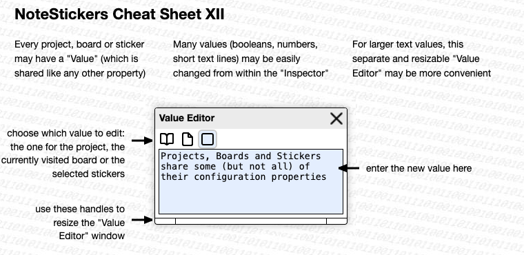

# note-stickers #

(an unshared application based on "[shareable-note-stickers](https://github.com/rozek/shareable-note-stickers)")

"NoteStickers" is the first step in a series of implementation and user studies towards a modern variant of Apple's famous but hopelessly underrated [HyperCard](https://en.m.wikipedia.org/wiki/HyperCard)

> (this is a "work in progress" - do not use it unless you are adventurous - and, if so, "save often" by "export"ing the "whole project" for a later re-import)

[live demo](https://rozek.github.io/note-stickers/dist/) (right now, for internal testing only - there still seems to be a really strange but fundamental problem when running from GitHub.io compared to an instance running from a local server...)

## Overview ##

"NoteStickers" works with "projects" containing one or multiple (nestable) "boards" with multiple "stickers" (which can not yet be nested). Projects, boards and stickers are special incarnations of "visuals" and share some of their properties.

Projects are automatically saved in a browser's storage area (indexeddb) and may be managed (i.e., created, edited, renamed, deleted) there. Since projects will get lost when the browser's storage is cleared, it is recommended to "download" every project onto the file system from which it may then be "uploaded" again later.

> Nota bene: in the current stage of development it is recommended to "download" often in order to save any work done with "NoteStickers"

"Boards" always cover the whole HTML element into which "NoteStickers" is rendered - this also includes the application's dialog windows. As a consequence, it is recommended to keep the containing element large enough (normally, the containign element is the document body and "NoteStickers" covers the whole browser window)

Only one board may be actually shown at a given time - that board is called to be "active" or "visited".

(to be continued)

## License ##

[MIT License](LICENSE.md)
